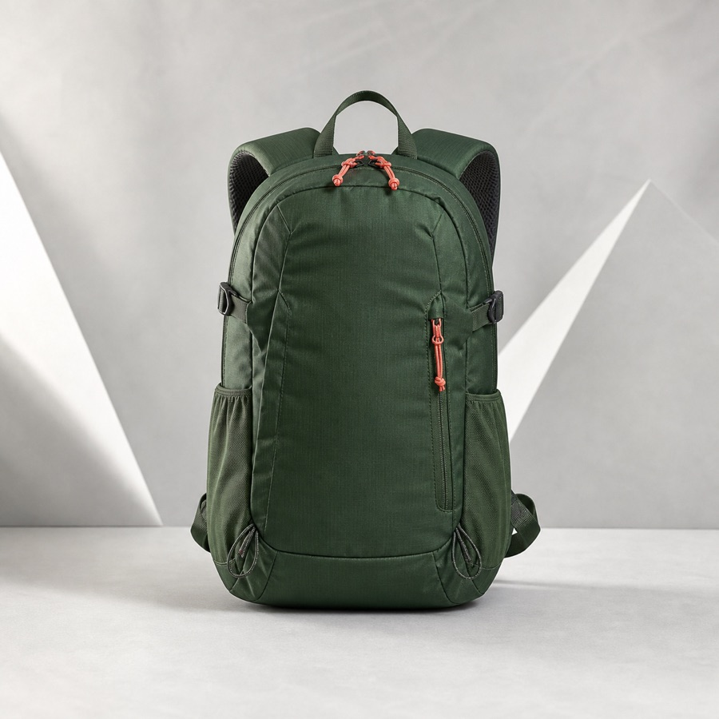

# 第 3 章 Demo：Image Pipeline Lab

本模块对应课程[第 3 章：图片加载框架](../../docs/chapter3/)，把文档中的缓存、尺寸、生命周期和列表竞态变成可运行实验。

| 森林背包 | 珊瑚耳机 | 黄色相机 |
| --- | --- | --- |
|  |  |  |

三张无品牌商品图是本章专用实验素材，同时参与占位图、资源加载、缓存身份和列表竞态，不是页面装饰。

## 实验入口

| 入口 | 观察内容 |
| --- | --- |
| Coil Lab | 三张图片、资源/网络模型、`ImageRequest`、缓存 Key、Scale、DataSource 与失败回调 |
| Glide Lab | 三张图片、资源/网络模型、`signature`、`override`、Scale、Target 与请求监听 |
| Race Lab | 背包和耳机竞争同一个 `ImageView`，观察身份校验如何阻止错位 |

## 操作顺序

### 缓存与版本

1. 进入 Coil Lab 或 Glide Lab，点击“加载图片”；
2. 保持条件不变再次加载，观察数据来源；
3. 点击“清内存”，再次加载；
4. 点击“版本 +1”，保持 URL 不变再次加载；
5. 比较日志中的 Key、DataSource 和耗时。

### 图片来源与 Scale

1. 选择背包、耳机或相机，先使用“来源：本地”加载 drawable；
2. 切换到“来源：网络”，观察 HTTPS 首次加载与再次加载的数据来源；
3. 在 `CENTER_CROP` 和 `FIT_CENTER` 之间切换，观察主体裁剪差异；
4. 检查日志中的缓存 Key 是否同步包含 `crop` 或 `fit`。

### 尺寸与内存

1. 在 `144 px` 和 `600 px` 之间切换；
2. 观察请求尺寸和估算的 ARGB_8888 内存；
3. 解释为什么尺寸变化后资源缓存身份也要变化。

### 失败链

1. 打开“注入 404”；
2. 执行加载并观察错误由网络获取阶段产生；
3. 关闭故障后重试；
4. 对比成功与失败日志。

### 列表竞态

1. 进入 Race Lab，先运行“不安全模式”；
2. Request-B 先返回，Request-A 后返回并覆盖结果；
3. 再运行“安全模式”；
4. 观察晚到的 Request-A 因失去 Target 所有权而被丢弃。

## 代码地图

```text
MainActivity                 Demo 入口选择
LabProduct                   图片、资源 ID、远程 URL 与业务身份
BaseImageLabActivity         缓存版本、尺寸、故障和日志面板
CoilLabActivity              Coil 请求实现
GlideLabActivity             Glide 请求实现
RaceLabActivity              无网络竞态复现
LabUi                        统一构建教学 UI
```

## 版本说明

本模块锁定 Coil 3.3 与 Glide 5.x，目的是在 SDK 35 / JDK 17 基线上保持示例可构建。课程正文讨论 Coil 3.x 与 Glide 5.x 的稳定机制；升级框架版本时，应重新执行全部实验并记录行为变化。

## 验收

- [ ] Coil 与 Glide 正常图片均可显示；
- [ ] 首次加载和内存命中的 DataSource 不同；
- [ ] 修改版本后不再命中旧结果；
- [ ] 修改目标尺寸后日志和估算内存同步变化；
- [ ] 本地/网络来源与 Crop/Fit 切换都能改变画面和缓存 Key；
- [ ] 404 能进入错误回调；
- [ ] Race Lab 能稳定复现并修复错位；
- [ ] Activity 销毁后没有旧回调更新页面。
